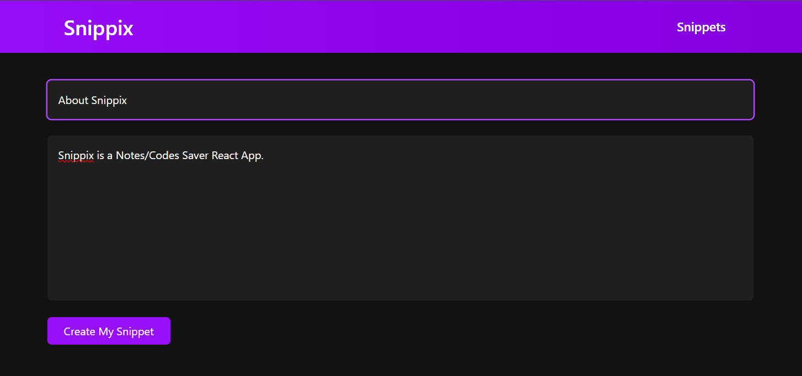
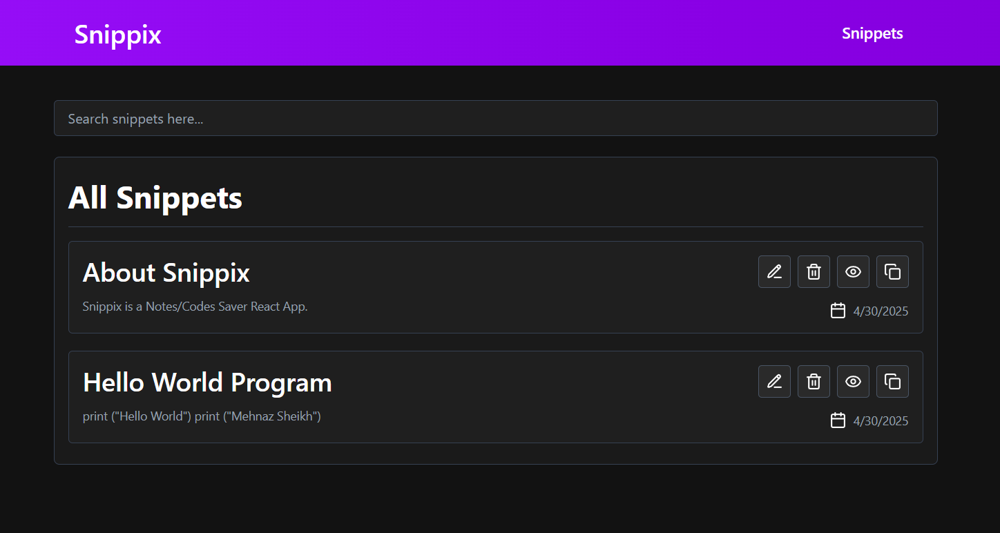

# Snippix 💻✨

Snippix is a modern snippet manager app that allows you to create, view, update, and organize your code snippets in a simple and efficient way. It helps you store your code snippets in one place and access them anytime, anywhere.

## Features 🚀

- **Create Snippets**: Add new code snippets with a title and value (content).
- **Edit Snippets**: Update your existing snippets with ease.
- **Delete Snippets**: Remove any snippets you no longer need.
- **Search Snippets**: Quickly find your snippets with the built-in search functionality.
- **View Snippets**: View full details of any snippet you've stored.
- **Dark Mode** 🌙: Enjoy a clean and comfortable experience with dark mode support.

## Tech Stack ⚙️

- **Frontend**: React, Tailwind CSS, React Router
- **State Management**: Redux for managing application state
- **Icons**: Lucide icons

## Installation 🛠️

To get started with Snippix, follow these steps:

1. **Clone the repository**:
   ```bash
   git clone https://github.com/your-username/snippix.git
   ```

2. **Navigate to the project directory**:
   ```bash
   cd snippix
   ```

3. **Install dependencies**:
   ```bash
   npm install
   ```

4. **Start the development server**:
   ```bash
   npm start
   ```
   This will launch the app in your browser at `http://localhost:3000`.

## Usage 📖

Once the app is running, you can:

1. **Create Snippets**: Go to the Home page and create new snippets by entering a title and content.
2. **View Snippets**: View your snippets in the Snippets page. You can also search for specific snippets using the search bar.
3. **Edit Snippets**: Edit the title and content of an existing snippet by selecting it from the Snippets page.
4. **Delete Snippets**: Remove snippets you no longer need with the delete button.
5. **Toggle Dark Mode**: Click the moon 🌙 icon in the navbar to toggle between light and dark modes.

## Screenshots 📸

### Home Page


### All Snippet View


### Snippet View


## Contributing 🤝

We welcome contributions! If you'd like to contribute to Snippix, please fork the repository, create a new branch, and submit a pull request. Here’s how you can contribute:

1. Fork the repository.
2. Create a feature branch (`git checkout -b feature-branch`).
3. Make your changes.
4. Commit your changes (`git commit -am 'Add new feature'`).
5. Push to your branch (`git push origin feature-branch`).
6. Submit a pull request.

## License 📝

This project is licensed under the MIT License - see the [LICENSE](LICENSE) file for details.

## Acknowledgements 🙏

- Thanks to [Lucide Icons](https://lucide.dev/) for providing amazing icons.
- A special thanks to [Tailwind CSS](https://tailwindcss.com/) for making styling a breeze.
- Thank you to the open-source community for their incredible tools and libraries.

Feel free to reach out if you have any questions or suggestions!

Happy coding! 😄
